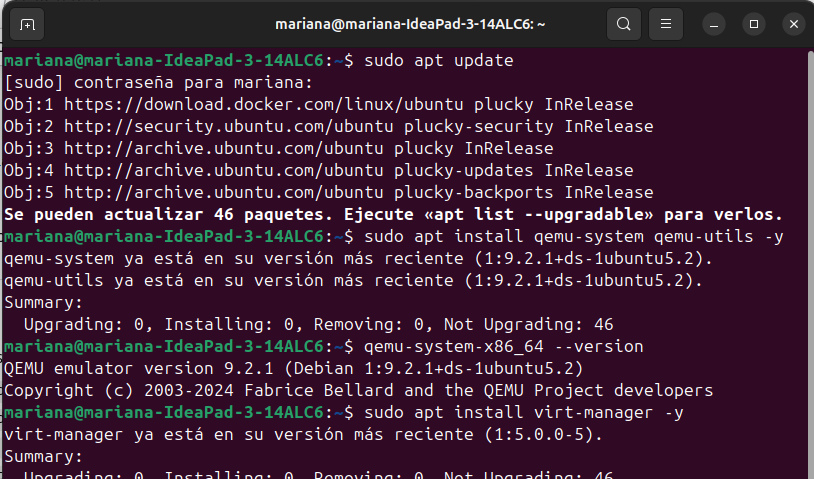

# Tarea-5: INVESTIGACIÓN SOBRE SISTEMAS OPERATIVOS 

##  Índice

1. Investigación  
   1.1. [Debian](#11-debian)  
   1.2. [Arch Linux](#12-arch-linux)  
   1.3. [Rocky Linux](#13-rocky-linux)  
   1.4. [Garuda Linux](#14-garuda-linux)  
   1.5. [Fedora](#15-fedora)  
   1.6. [Manjaro](#16-manjaro)  
   1.7. [CentOS](#17-centos)  
   1.8. [Kali Linux](#18-kali-linux)  
   1.9. [Linux Mint](#19-linux-mint)  
   1.10. [Ubuntu](#110-ubuntu)  
   1.11. [Alpine Linux](#111-alpine-linux)  
   1.12. [AlmaLinux](#112-almalinux)

2. Instalación Quemu
   
   2.1. [Qué és](#21-qué-es)  
   2.2. [Paso a paso para la instalación](#22-paso-a-paso-para-la-instalación)  

---

## 1.1 Debian

**a. Historia:**  
Debian fue fundado en 1993 por Ian Murdock con el objetivo de crear una distribución GNU/Linux completamente libre y mantenida por la comunidad. Su nombre combina los de su creador y su esposa, reflejando un proyecto personal y colaborativo. Desde sus primeras versiones, Debian estableció un modelo de gobernanza comunitaria único con su Constitución y Contrato Social. A lo largo del tiempo, se organizó en ramas (*stable*, *testing*, *unstable*) para equilibrar estabilidad y desarrollo continuo. Debian ha sido la base para muchas otras distribuciones, incluyendo Ubuntu y Linux Mint, consolidando su influencia en el ecosistema. Su comunidad global de desarrolladores contribuye a mantener y actualizar miles de paquetes disponibles para múltiples arquitecturas. Debian sigue siendo un referente de estabilidad y libertad en software libre.

**b. ¿Qué es?:**  
Debian es una distribución GNU/Linux de propósito general, mantenida por una comunidad global de voluntarios. Está diseñada para ofrecer estabilidad, portabilidad y libertad de software. Los paquetes se distribuyen principalmente bajo licencias libres, y su gestión se realiza con herramientas como APT y DPKG. Debian soporta múltiples arquitecturas, incluyendo x86, ARM y RISC-V, lo que la hace muy versátil para servidores, escritorios y sistemas embebidos. Además, sus repositorios incluyen más de 50,000 paquetes verificados. Debian es ideal para quienes buscan un sistema predecible y confiable, y sirve como base para muchas otras distribuciones derivadas. Su documentación exhaustiva y activa comunidad hacen que aprender y mantener Debian sea accesible para usuarios avanzados y novatos. 

**c. Características:**  
Debian destaca por su estabilidad y enfoque en software libre, ofreciendo ramas estables y de prueba. Su sistema de gestión de paquetes APT permite instalar, actualizar y eliminar software de manera eficiente. La compatibilidad multiarquitectura asegura soporte para distintos tipos de hardware, desde servidores hasta dispositivos embebidos. Sus ciclos de actualización son largos y conservadores, priorizando seguridad y compatibilidad. Debian incluye repositorios vastos y documentación oficial extensa. También permite personalización avanzada para usuarios que desean un control total sobre el sistema. Su enfoque comunitario y de calidad ha influido en la creación de numerosas distribuciones derivadas, consolidándolo como un estándar de referencia.

**d. Uso y aplicaciones:**  
Debian se utiliza ampliamente en servidores web, infraestructura de red, estaciones de trabajo y sistemas embebidos. Su estabilidad lo hace idóneo para entornos críticos donde los fallos pueden ser costosos. Es una base popular para derivadas como Ubuntu y Linux Mint, que adaptan Debian a distintos públicos. En entornos educativos y de investigación, Debian es útil para aprender sobre administración de sistemas y desarrollo de software. Los administradores de sistemas confían en Debian para mantener servicios con alta disponibilidad. Además, su compatibilidad multiarquitectura permite desplegarlo en dispositivos ARM, contenedores y hardware heterogéneo. Su robustez y confiabilidad lo convierten en una opción preferida en producción.

---

## 1.2 Arch Linux

**a. Historia:**  
Arch Linux fue creado en 2002 por Judd Vinet con la intención de ofrecer un sistema simple, ligero y flexible. Se inspiró en la filosofía minimalista de CRUX, enfocándose en el control total por parte del usuario. Desde sus inicios promovió la filosofía KISS ("Keep It Simple, Stupid"), y desarrolló herramientas propias como el gestor de paquetes pacman. La Arch Wiki se convirtió rápidamente en referencia mundial por su calidad y exhaustividad. Arch introdujo el modelo *rolling release*, manteniendo el sistema continuamente actualizado. Su comunidad se ha caracterizado por documentar y compartir buenas prácticas, convirtiéndose en un recurso educativo. Arch se consolidó como una distribución para usuarios avanzados que desean aprender los entresijos de Linux.

**b. ¿Qué es?:**  
Arch Linux es una distribución independiente y rolling release, diseñada para usuarios avanzados que buscan flexibilidad y control total del sistema. No impone configuraciones predefinidas y permite instalar un sistema base mínimo que el usuario personaliza completamente. Su repositorio oficial y el repositorio comunitario AUR ofrecen software actualizado continuamente. Arch es ideal como plataforma educativa para aprender sobre administración de paquetes, configuración del kernel y optimización del sistema. Ofrece documentación extensa en la Arch Wiki y soporte activo de la comunidad. Es adecuado para escritorios personalizados, estaciones de trabajo de desarrollo y laboratorios de pruebas. Arch combina minimalismo con potencia y aprendizaje profundo.

**c. Características:**  
Arch Linux utiliza pacman como gestor de paquetes y permite la instalación de software desde AUR. Su modelo rolling release mantiene el sistema actualizado sin reinstalaciones. Permite instalar solo lo necesario, reduciendo la huella de recursos y aumentando la eficiencia. La configuración manual fomenta la comprensión profunda del sistema y la resolución de problemas. Arch soporta múltiples arquitecturas y es altamente modular. Su comunidad mantiene documentación de alta calidad y guías para la instalación y resolución de incidencias. Arch es ideal para usuarios que quieren experimentar con software reciente sin perder control sobre el sistema.

**d. Uso y aplicaciones:**  
Arch se utiliza principalmente por usuarios avanzados, desarrolladores y entusiastas que buscan un entorno flexible y actual. Sirve como plataforma de pruebas, laboratorios de aprendizaje y desarrollo de software. Muchos sistemas derivados usan Arch como base para crear experiencias listas para el usuario final. Arch es excelente para escritorios personalizados y estaciones de trabajo de alto rendimiento. No es la opción principal en entornos empresariales que requieren soporte estable y predecible. Administradores lo usan en entornos educativos o laboratorios donde la última versión de software es esencial. Su documentación y comunidad activa facilitan la resolución de problemas complejos.

---

## 1.6 Manjaro

**a. Historia:**  
Manjaro Linux fue lanzado en 2011 por Roland Singer y Guillaume Benoit, con el objetivo de ofrecer la potencia de Arch Linux en una versión más accesible. A lo largo de los años, Manjaro ha crecido en popularidad por su facilidad de instalación y estabilidad. Su desarrollo se centra en simplificar el uso de Arch mediante herramientas gráficas, gestores de software y controladores preinstalados. El equipo de Manjaro mantiene repositorios propios sincronizados con Arch, priorizando estabilidad sobre rapidez. Gracias a esto, se ha convertido en una de las distribuciones más amigables para usuarios intermedios.

**b. ¿Qué es?:**  
Manjaro es una distribución basada en Arch Linux que ofrece una experiencia optimizada y lista para usar. Integra un instalador gráfico, actualizaciones gestionadas y un entorno estable. Su propósito es brindar a los usuarios las ventajas de Arch sin la complejidad técnica de su instalación manual. Utiliza Pacman como gestor de paquetes, junto con acceso al AUR. Incluye ediciones oficiales con escritorios XFCE, KDE y GNOME. Manjaro busca equilibrio entre facilidad, rendimiento y personalización, siendo ideal para quienes quieren aprender Linux de forma práctica.

**c. Características:**  
Manjaro combina estabilidad, soporte continuo y acceso a software moderno. Usa un modelo rolling release moderado, verificando los paquetes antes de liberarlos al usuario. Ofrece detección automática de hardware, controladores preinstalados y una comunidad activa. Sus herramientas gráficas permiten administrar paquetes, kernels y actualizaciones fácilmente. Manjaro incorpora soporte nativo para Snap, Flatpak y AUR. Sus interfaces se adaptan a distintos perfiles: desde usuarios básicos hasta avanzados. Es compatible con arquitecturas x86_64 y ARM. Su entorno es rápido, seguro y personalizable.

**d. Uso y aplicaciones:**  
Manjaro se utiliza ampliamente en entornos de escritorio, educación y desarrollo. Es ideal para programadores que buscan un sistema actualizado y estable. Su simplicidad lo convierte en una excelente opción para migrar desde Windows. También se usa en dispositivos ARM, como la Raspberry Pi. Los entornos de escritorio disponibles permiten flexibilidad de uso, desde tareas básicas hasta diseño y multimedia. Manjaro es apreciado por su balance entre personalización y estabilidad, siendo una puerta de entrada al mundo Arch. Su comunidad mantiene soporte y documentación extensiva.

---

## 1.7 CentOS

**a. Historia:**  
CentOS (Community ENTerprise Operating System) fue fundado en 2004 por Gregory Kurtzer como una versión gratuita y comunitaria de Red Hat Enterprise Linux (RHEL). Su propósito fue ofrecer compatibilidad binaria total con RHEL sin requerir suscripciones. Durante años, CentOS se convirtió en la base preferida para servidores empresariales. En 2014, Red Hat adoptó oficialmente el proyecto, garantizando su desarrollo conjunto. Sin embargo, en 2020, Red Hat cambió el enfoque hacia CentOS Stream, lo que llevó al nacimiento de proyectos alternativos como Rocky Linux y AlmaLinux.

**b. ¿Qué es?:**  
CentOS es una distribución Linux enfocada en ofrecer una plataforma empresarial estable, compatible con RHEL. Se diseñó para servidores, infraestructuras críticas y entornos corporativos. Su meta fue reproducir la funcionalidad y estabilidad de Red Hat sin costo. CentOS se distingue por su longevidad de soporte y actualizaciones controladas. Es ampliamente usado en hosting, nube privada y sistemas de bases de datos. Su evolución hacia CentOS Stream lo convirtió en una plataforma de desarrollo previa a RHEL, orientada a pruebas de nuevas versiones del sistema.

**c. Características:**  
CentOS ofrece estabilidad, compatibilidad y seguridad a largo plazo. Su ciclo de vida extendido lo hace ideal para servidores de misión crítica. Usa YUM/DNF como gestor de paquetes y SELinux como capa de seguridad reforzada. Es compatible con las herramientas empresariales de Red Hat y con configuraciones de sistemas automatizados. Posee una gran comunidad de soporte, documentación y repositorios verificados. Su sistema de actualizaciones prioriza la fiabilidad sobre la novedad. Es ideal para entornos corporativos que requieren consistencia y compatibilidad con RHEL.

**d. Uso y aplicaciones:**  
CentOS se ha utilizado ampliamente en servidores web, bases de datos y entornos empresariales. Es común en centros de datos, hosting y servicios en la nube. Su estabilidad lo convierte en una opción confiable para infraestructuras críticas. También se usa en universidades y laboratorios para pruebas y desarrollo de software. Con CentOS Stream, su rol se amplió a la prueba previa de versiones RHEL, facilitando la innovación en entornos de producción controlados. Permite una transición fluida hacia distribuciones compatibles como Rocky o AlmaLinux.

---

## 1.8 Kali Linux

**a. Historia:**  
Kali Linux fue desarrollado por Offensive Security en 2013 como sucesor de BackTrack, una distribución centrada en seguridad informática. Su creación respondió a la necesidad de una plataforma moderna, segura y mantenida activamente para pruebas de penetración y análisis forense. Kali se basa en Debian y sigue un modelo rolling release, manteniendo las herramientas actualizadas. A lo largo de los años, ha sido adoptado por expertos en ciberseguridad, investigadores y agencias gubernamentales. Su desarrollo se centra en la profesionalización del hacking ético y la formación en seguridad ofensiva.

**b. ¿Qué es?:**  
Kali Linux es una distribución orientada a la seguridad, el hacking ético y la investigación forense digital. Está diseñada para profesionales en ciberseguridad que realizan pruebas de penetración. Incluye más de 600 herramientas preinstaladas para análisis de redes, ingeniería inversa, explotación de vulnerabilidades y criptografía. Su base Debian le proporciona estabilidad y compatibilidad con hardware moderno. Kali puede ejecutarse como sistema instalado o en modo live. Su entorno está optimizado para el análisis y detección de vulnerabilidades en sistemas.

**c. Características:**  
Kali Linux ofrece soporte para arquitecturas múltiples, entornos de escritorio personalizables y actualizaciones constantes. Su modelo rolling release garantiza acceso a las últimas versiones de herramientas de seguridad. Incluye utilidades como Metasploit, Wireshark, Burp Suite y Aircrack-ng. Kali enfatiza la seguridad del usuario mediante políticas de acceso controlado. Ofrece imágenes preconfiguradas para máquinas virtuales y ARM. También dispone de la edición “NetHunter” para dispositivos móviles. Su integración con entornos forenses lo convierte en una herramienta versátil para investigación digital.

**d. Uso y aplicaciones:**  
Kali Linux se emplea en auditorías de seguridad, análisis forense y formación en hacking ético. Es utilizado por profesionales y estudiantes de ciberseguridad en pruebas de penetración y evaluación de sistemas. También se usa en laboratorios virtuales y entornos educativos. Sus herramientas permiten detectar vulnerabilidades, analizar tráfico de red y realizar pruebas de resistencia. Kali es esencial para equipos de seguridad ofensiva (Red Teams). Su flexibilidad y documentación lo hacen una referencia global en seguridad informática.  

---

## 1.9 Linux Mint

**a. Historia:**  
Linux Mint apareció en 2006, creado por Clément Lefèbvre, con el objetivo de ofrecer una distribución amigable y estable para usuarios de escritorio. Basada en Ubuntu (y anteriormente en Debian), Mint ha evolucionado hacia la simplicidad y usabilidad. Su desarrollo se centra en la experiencia de usuario, brindando entornos como Cinnamon, MATE y XFCE. Con los años, Linux Mint se consolidó como una de las distribuciones más populares entre principiantes. Su filosofía prioriza la facilidad de uso, estabilidad y compatibilidad con hardware diverso.  

**b. ¿Qué es?:**  
Linux Mint es una distribución basada en Ubuntu/Debian diseñada para proporcionar un entorno de escritorio sencillo, elegante y funcional. Está enfocada en usuarios que migran desde Windows. Incluye un conjunto de aplicaciones esenciales listas para usar, eliminando la necesidad de configuraciones iniciales. Mint busca equilibrio entre rendimiento, estabilidad y estética. Su entorno Cinnamon ofrece una experiencia moderna con bajo consumo de recursos. Es mantenido por una comunidad activa que prioriza la accesibilidad y el soporte a largo plazo.  

**c. Características:**  
Linux Mint incluye un instalador gráfico intuitivo, soporte multimedia nativo y actualizaciones automáticas seguras. Su gestor de software simplifica la instalación de paquetes. Posee herramientas propias como MintUpdate, MintBackup y MintMenu. Ofrece estabilidad derivada de Ubuntu LTS, compatibilidad con paquetes DEB y soporte para Snap y Flatpak. Su entorno Cinnamon es ligero, personalizable y fácil de adaptar. Linux Mint destaca por su bajo consumo de recursos, alto rendimiento en hardware antiguo y soporte comunitario confiable.  

**d. Uso y aplicaciones:**  
Linux Mint se usa principalmente en equipos de escritorio y portátiles personales. Es ideal para educación, oficina, diseño básico y navegación. Su facilidad de uso lo convierte en una opción popular entre usuarios nuevos en Linux. También se utiliza en entornos empresariales livianos y laboratorios educativos. Mint ofrece estabilidad suficiente para tareas de desarrollo o productividad. Su compatibilidad con software de Ubuntu lo hace versátil y funcional. Es la elección perfecta para quienes buscan un sistema rápido, estético y confiable.  

---

## 1.10 Ubuntu

**a. Historia:**  
Ubuntu fue lanzado en 2004 por Mark Shuttleworth y su empresa Canonical, con la intención de hacer Linux accesible a todos los usuarios. Basado en Debian, Ubuntu introdujo ciclos de lanzamiento regulares y versiones LTS con soporte extendido. A lo largo del tiempo, se convirtió en una de las distribuciones más influyentes y adoptadas a nivel mundial. Ha servido como base para numerosos sistemas derivados. Ubuntu ha impulsado la adopción de Linux en escritorios, servidores y la nube, manteniendo su filosofía de software libre y facilidad de uso.  

**b. ¿Qué es?:**  
Ubuntu es una distribución basada en Debian orientada a la facilidad de uso, estabilidad y compatibilidad. Ofrece versiones para escritorio, servidor y nube. Su enfoque principal es brindar una experiencia moderna con soporte profesional. Ubuntu utiliza el sistema de paquetes APT y Snap, lo que amplía el acceso a software. Su entorno GNOME proporciona una interfaz limpia y adaptable. Es mantenido por Canonical, pero con fuerte apoyo comunitario. Ubuntu se distingue por su compromiso con la accesibilidad, seguridad y el soporte extendido de versiones LTS.  

**c. Características:**  
Ubuntu cuenta con soporte a largo plazo (LTS), actualizaciones constantes y compatibilidad con hardware moderno. Ofrece Snap Store, un sistema de instalación universal. Su integración con servicios en la nube, virtualización y contenedores (como Docker) lo hace ideal para desarrolladores. Posee un sistema de permisos seguro, una comunidad global y documentación extensa. Es altamente compatible con controladores y dispositivos. Su arquitectura modular permite adaptarse a servidores, IoT y estaciones de trabajo. Ubuntu equilibra estabilidad con innovación constante.  

**d. Uso y aplicaciones:**  
Ubuntu es ampliamente utilizado en educación, empresas, servidores web y computación en la nube. Es la base de servicios como AWS, Google Cloud y Azure. En el escritorio, se usa para tareas de desarrollo, multimedia y productividad. Ubuntu Server domina en entornos empresariales debido a su fiabilidad. También es una plataforma clave para proyectos de IA, DevOps y contenedores. Su accesibilidad lo hace ideal para principiantes y expertos. Ubuntu es uno de los pilares del ecosistema Linux moderno.  

---

## 1.11 Alpine Linux

**a. Historia:**  
Alpine Linux fue creado en 2005 por miembros del proyecto LEAF con el objetivo de desarrollar una distribución ligera y segura para sistemas embebidos. Su diseño minimalista surgió como alternativa a distribuciones más pesadas. Desde sus inicios, Alpine ha destacado por su uso de musl libc y BusyBox, optimizando rendimiento y tamaño. Ha ganado popularidad en entornos de contenedores, especialmente con Docker, por su bajo consumo. Alpine ha mantenido un ciclo de actualizaciones regular y un enfoque fuerte en la seguridad.  

**b. ¿Qué es?:**  
Alpine Linux es una distribución ligera basada en seguridad, orientada a entornos de contenedores y sistemas embebidos. Su diseño compacto permite imágenes mínimas de pocos megabytes. Utiliza musl libc y BusyBox para reducir dependencias. Es una distribución comunitaria, mantenida activamente y pensada para administradores que buscan eficiencia. Alpine prioriza la simplicidad y seguridad, evitando configuraciones innecesarias. Está especialmente optimizada para contenedores Docker, donde su tamaño pequeño mejora rendimiento y despliegue.  

**c. Características:**  
Alpine Linux se distingue por su bajo consumo de recursos, enfoque en seguridad y tamaño reducido. Implementa un sistema de parches frecuentes y control de integridad. Usa OpenRC como gestor de servicios, en lugar de systemd. Su gestor de paquetes `apk` es rápido y ligero. Alpine incluye un kernel endurecido y bibliotecas optimizadas. Su diseño modular permite personalización completa. Es ideal para desarrolladores que buscan entornos limpios y seguros. También ofrece soporte para arquitectura ARM y sistemas de virtualización ligera.  

**d. Uso y aplicaciones:**  
Alpine Linux se utiliza en contenedores Docker, sistemas embebidos y microservicios. Su tamaño mínimo reduce tiempos de despliegue y consumo de almacenamiento. Es ampliamente empleado por desarrolladores DevOps y en plataformas CI/CD. También se usa en routers, firewalls y sistemas con recursos limitados. Alpine permite crear entornos reproducibles, rápidos y seguros. Es la base de muchas imágenes oficiales de Docker por su eficiencia. Su confiabilidad y ligereza lo hacen ideal para entornos modernos de computación distribuida.  

---

## 1.12 AlmaLinux

**a. Historia:**  
AlmaLinux fue creado en 2021 por la empresa CloudLinux como respuesta al cambio de CentOS hacia Stream. Nació con la intención de ofrecer una alternativa gratuita y totalmente compatible con RHEL. Desde su inicio, el proyecto se entregó a la comunidad mediante la Fundación AlmaLinux OS Foundation. Su nombre proviene de la palabra latina “alma”, que significa “alma” o “espíritu”, simbolizando su propósito comunitario. AlmaLinux rápidamente se consolidó como una opción confiable y estable para reemplazar CentOS clásico.  

**b. ¿Qué es?:**  
AlmaLinux es una distribución Linux empresarial gratuita y de código abierto, 100% compatible binariamente con Red Hat Enterprise Linux (RHEL). Está mantenida por una fundación sin fines de lucro que garantiza su independencia. Su objetivo principal es ofrecer una plataforma de servidor segura, estable y predecible. AlmaLinux es ideal para empresas y desarrolladores que requieren compatibilidad con software certificado para RHEL sin costos de licencia. Su ciclo de soporte prolongado lo convierte en una opción sólida para producción.  

**c. Características:**  
AlmaLinux ofrece compatibilidad total con RHEL, soporte a largo plazo y parches de seguridad frecuentes. Usa DNF como gestor de paquetes y SELinux para control de acceso reforzado. Su estructura organizacional abierta garantiza sostenibilidad comunitaria. Es compatible con herramientas de administración y automatización como Ansible, Podman y Cockpit. AlmaLinux proporciona imágenes listas para nubes públicas y privadas. Está optimizado para entornos empresariales y de virtualización. Su rendimiento y fiabilidad lo hacen ideal para cargas críticas.  

**d. Uso y aplicaciones:**  
AlmaLinux se utiliza en servidores empresariales, nubes híbridas y entornos de desarrollo. Es la elección preferida de quienes migraron desde CentOS. Se emplea en hosting, bases de datos, servicios web y contenedores. Su compatibilidad con RHEL permite ejecutar aplicaciones empresariales sin modificaciones. AlmaLinux es usado por universidades, instituciones gubernamentales y empresas que buscan estabilidad a largo plazo. Su comunidad mantiene soporte técnico y documentación completa. Representa una alternativa robusta y abierta para infraestructuras de misión crítica.  

---
2. 

## 2.1 ¿Qué es?
QEMU (Quick EMUlator) es un emulador y virtualizador de código abierto que permite ejecutar sistemas operativos completos dentro de otros sistemas. Funciona simulando hardware (CPU, memoria, red, disco, etc.), lo que lo convierte en una herramienta ideal para crear entornos de práctica, probar software o sistemas sin alterar el sistema principal.

Virt-Manager (Virtual Machine Manager) es una interfaz gráfica que facilita el uso de QEMU/KVM, permitiendo crear, configurar y monitorear máquinas virtuales de manera visual, sin depender exclusivamente de la terminal.

---

## 2.2 Paso a paso para la instalación 

Comandos usados: 
a. Actualizar repositorios
sudo apt update

b. Instalar QEMU y utilidades
sudo apt install qemu-system qemu-utils -y

c.  Verificar versión de QEMU
qemu-system-x86_64 --version

d. Instalar Virt-Manager (interfaz gráfica)
sudo apt install virt-manager -y

## Respuesta de salida:

### Referencias 

- [Debian.org](https://www.debian.org/)  
- [ArchLinux.org](https://archlinux.org/)  
- [RockyLinux.org](https://rockylinux.org/)  
- [GarudaLinux.org](https://garudalinux.org/)  
- [FedoraProject.org](https://getfedora.org/)  
- [Manjaro.org](https://manjaro.org/)  
- [CentOS.org](https://www.centos.org/)  
- [Kali.org](https://www.kali.org/)  
- [LinuxMint.com](https://linuxmint.com/)  
- [Ubuntu.com](https://ubuntu.com/)  
- [AlpineLinux.org](https://alpinelinux.org/)  
- [AlmaLinux.org](https://almalinux.org/)
